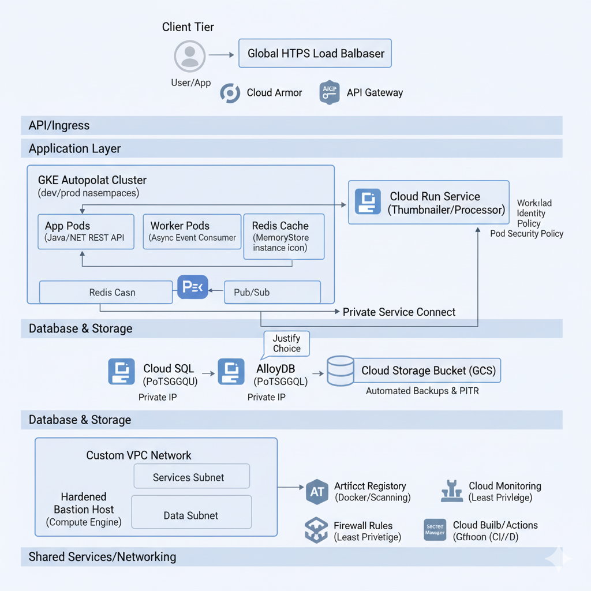

# Java Spring Boot on GCP with GKE Autopilot

This project demonstrates a complete CI/CD setup for a Java Spring Boot application deployed to Google Kubernetes Engine (GKE) on Google Cloud Platform (GCP). The infrastructure is provisioned using Terraform, and the deployment is automated with GitHub Actions.



## Features

- **Application**: A simple Java 17 / Spring Boot REST API.
- **Infrastructure as Code**: Terraform scripts to create a GKE Autopilot cluster, Cloud SQL (Postgres), Artifact Registry, and other required GCP resources.
- **CI/CD**: Two distinct GitHub Actions workflows for:
    1.  **Infrastructure**: Applying Terraform changes to provision/update GCP resources.
    2.  **Application**: Building the Java app, containerizing it with Docker, pushing the image to Artifact Registry, and deploying it to GKE.
- **Kubernetes**: Manifests for deploying the application, including Deployment, Service, Ingress, HPA, and more.

## Repository Structure

```
├── .github/workflows/    # GitHub Actions CI/CD pipelines
│   ├── application-deployment.yaml
│   └── infra.yaml
├── app/                  # Java Spring Boot application source code
├── infra/                # Terraform code for GCP infrastructure
├── k8s/                  # Kubernetes manifests for application deployment
├── docs/                 # architecure image
└── README.md
```

- **`.github/workflows/`**: Contains the CI/CD pipelines.
    - `infra.yaml`: Deploys the GCP infrastructure using Terraform. Triggered manually.
    - `application-deployment.yaml`: Builds and deploys the Spring Boot application. Triggered on push to `dev` or manually.
- **`app/`**: A Maven-based Spring Boot application that provides a file upload endpoint.
- **`infra/`**: Contains all Terraform modules to create the necessary GCP infrastructure. See the infra/README.md for more details.
- **`k8s/`**: Holds all Kubernetes YAML manifests required to run the application on GKE.

## Prerequisites

Before you begin, ensure you have the following tools installed:

- `gcloud` CLI
- `terraform` CLI (v1.1.0+)
- `kubectl`
- `docker`
- Java 17+
- Maven

You will also need a GCP project and a service account with sufficient permissions to create the resources defined in the `infra` directory.

## Setup and Deployment

### 1. Configure GitHub Secrets

Set the following secrets in your GitHub repository (`Settings > Secrets and variables > Actions`):

- `GCP_SA_KEY`: The JSON key for your GCP service account.
- `PROJECT_ID`: Your GCP Project ID.
- `REGION`: The GCP region to deploy resources in (e.g., `asia-south1`).
- `REPOSITORY`: The name of your Artifact Registry repository.
- `IMAGE_NAME`: The name for your Docker image.

### 2. Provision Infrastructure

The infrastructure is managed by the `infra.yaml` workflow.

1.  Navigate to the **Actions** tab in your GitHub repository.
2.  Select the **Terraform CI/CD** workflow.
3.  Click **Run workflow**, choose the environment (`dev` or `prod`), and run it.

This will execute `terraform apply` and create all the necessary GCP resources. For manual setup, refer to the instructions in `infra/README.md`.

### 3. Deploy the Application

The application is deployed by the `application-deployment.yaml` workflow.

1.  **Automatic Deployment**: Pushing a commit to the `dev` branch will automatically trigger the workflow to build and deploy the latest version of the application to the `dev` environment.

2.  **Manual Deployment**:
    1.  Navigate to the **Actions** tab.
    2.  Select the **CI/CD Pipeline** workflow.
    3.  Click **Run workflow**, choose the target environment, and optionally provide a custom image tag.

This workflow builds the Docker image, pushes it to Google Artifact Registry, and applies the Kubernetes manifests from the `k8s/` directory to deploy the application to your GKE cluster.
